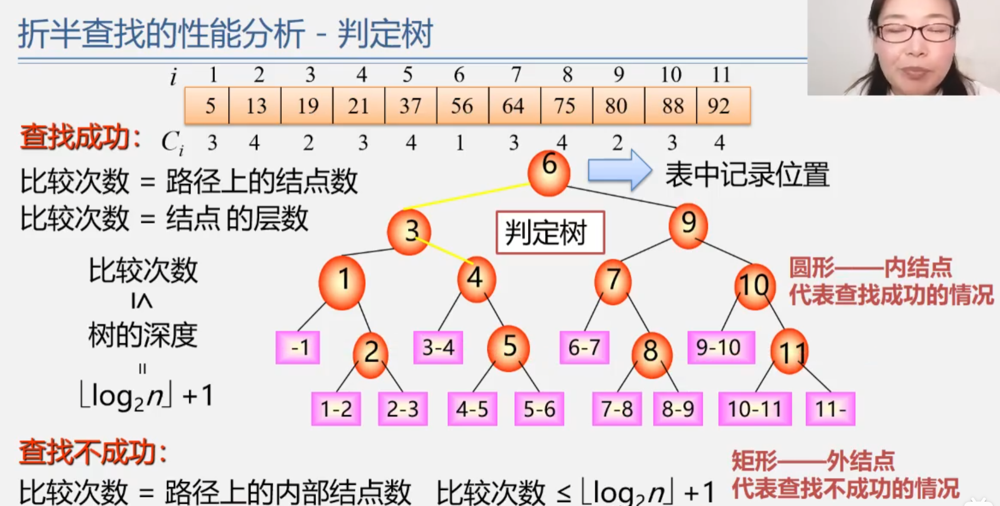
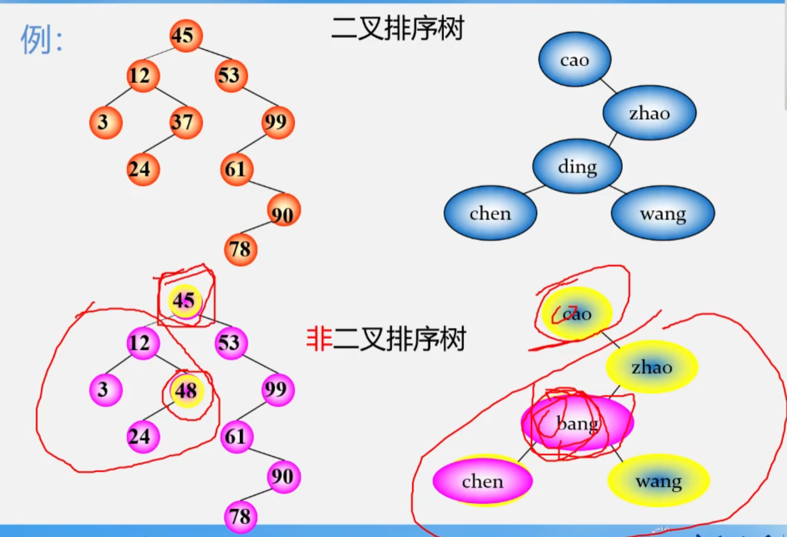

# 查找的概念
:raising_hand: 在哪里找？   
                     ——查找表

查找表是由同一类型的数据元素 (或记录) 构成的集合。由于“集合”中的数据元素之间存在着松散的关系，因此查找表是一种应用灵便的结构

:raising_hand: 什么查找？——
根据给定的某个值，在查找表中确定一个其关键字等于给定值
的数据元素或(记录)  
**关键字**：用来标识一个数据元素 (或记录)的某个数据项的值
+ **主关键字**：可唯一地标识一个记录的关键字是主关键字
+ **次关键字**：反之，用以识别若千记录的关键字是次关键字。

:raising_hand: 查找成功否？
+ 若查找表中存在这样一个记录，则称“查找成功”查找结果给出整个记录的信息，或指示该记录在查找表中的位置、
+ 否则称“查找不成功”，查找结果给出“空记录”或“空指针”

:raising_hand: 查找的目的？
1. 查询某个“特定的”数据元素是否在查找表中
2. 检索某个“特定的”数据元素的各种属性
3. 在查找表中插入一个数据元素
4. 删除查找表中的某个数据元素

:raising_hand: 查找表怎么分类？
+ 静态查找表
  - 仅作“查询”（检索）操作的查找表
+ 动态查找表
  - 作“插入”和“删除”操作的查找表作
  - 有时在查询之后，还需要将“查询”结果为“不在查找表中”的数据元素插入到查找表中;
  - 或者，从查找表中删除其“查询”结果为在查找表中”的数据元素，此类表为动态查找表

:raising_hand: 如何评价查找算法？

关键字的平均比较次数，也称**平均查找长度**ASL(AVerage Search Length)
$$ASL=\displaystyle\sum_{i=1}^{n} p_ic_i   （关键字比较次数的期望值）$$

+ n：记录的个数
+ p<sub>i</sub>:查找第i个记录的概率（通常认为p<sub>i</sub>=1/n）  
+ c<sub>i</sub>：找到第i个记录所需的比较次数
  
:raising_hand: 如何评价查找算法？

查找的方法取决于查找表的结构，即表中数据元素是依何种关系组织在一起的。
由于对查找表来说，在集合中查询或检索一个“特定的”数据元素时若无规律可循，只能对集合中的元素一一加以辨认直至找到为止。
而这样的“查询”或“检索”是任何计算机应用系统中使用频度都很高的操作，因此设法提高查找表的查找效率，是本章讨论问题的出发点
为提高查找效率一个办法就是在构造查找表时，在集合中的数据元素之间人为地加上某种确定的约束关系
研究查找表的各种组织方法及其查找过程的实施
# 线性表的查找
## 顺序查找
应用范围
+ 顺序表或线性链表表示的静态查找表
+ 表内元素之间无序

时间复杂度：O(n)  
空间复杂度：O（1）  
ASL(n)=（n+1）/2  

:point_right: 1、记录的查找概率不相等时如何提高查找效率?
+ 查找表存储记录原则一按查找概率高低存储
+ 1)查找概率越高，比较次数越少
+ 2)查找概率越低，比较次数较多

:point_right: 记录的查找概率无法测定时如何提高查找效率?
+ 方法按查找概率动态调整记录顺序
+ 1)在每个记录中设一不访问频度域
+ 2)始终保持记录按非递增有序的次序排列
+ 3)每次查找后均将刚查到的记录直接移至表头
  
**特点**：  
+ 优点: 算法简单，逻辑次序无要求，且不同存储结构均适用。
+ 缺点: ASL太长，时间效率太低
## 二分查找（折半查找，对分查找）
**有序表**

折半查找: 每次将待查记录所在区间缩小一半
+ 设表长为n，low、high和mid分别指向待查元素所在区间的上界下界和中点，key为给定的要查找的值:
+ 初始时，令low=1，high=n，mid=L(low+high)/2
+ 让k与mid指向的记录比较
    - 若keY==R[mid].key， 查找成功
    - 若key<R[mid].key，则 high=mid-1
    - 若key>R[mid].key，则 low=mid+1
+ 重复上述操作，直至low>high时查找失败

```#include <iostream>
#include <vector>

// 二分查找函数
int binarySearch(const std::vector<int>& arr, int target) {
    int left = 0;
    int right = arr.size() - 1;

    while (left <= right) {
        int mid = left + (right - left) / 2;

        // 检查中间元素是否是目标值
        if (arr[mid] == target) {
            return mid;  // 目标值找到，返回索引
        } else if (arr[mid] < target) {
            left = mid + 1;  // 目标值可能在右半部分
        } else {
            right = mid - 1;  // 目标值可能在左半部分
        }
    }

    return -1;  // 目标值不在数组中
}

int main() {
    // 测试二分查找
    std::vector<int> sortedArray = {1, 2, 3, 4, 5, 6, 7, 8, 9, 10};
    int target = 6;

    int result = binarySearch(sortedArray, target);

    if (result != -1) {
        std::cout << "目标值 " << target << " 在数组中，索引为 " << result << std::endl;
    } else {
        std::cout << "目标值 " << target << " 不在数组中" << std::endl;
    }

    return 0;
}
```
**判定树**：   
:point_right: ASL（成功时）： 
设表长 n = 2<sup>h</sup>-1，则 h= log<sub>2</sub>(n +1) (此时，判定树为深度=h的满二又树)，且表中每个记录的查找概率相等: p<sub>i</sub>=1/n。则：  
$$ASL=\frac{n+1}{n}log_2(n-1)-1$$
**特点**：  
+ 优点: 效率比顺序查找高折半查找
+ 缺点: 只适用于有序表且限子顺序存储结构 (对线性链表无效）
## 分块查找（索引顺序查找）
**条件**：
+ 1、将表分成几块，且表有序，或者分块有序；若i<j，则第j块中所有记录的关键字均大于第i块中的最大关键字
+ 2、建立“索引表” (每个结点含有最大关键字域和指向本块第一个结点的指针，且按关键字有序)

**查找过程**:  
先确定待查记录所在块(顺序或折半查找)再在块内查找(顺序查找)

:point_right: ASL=L<sub>b</sub>+L<sub>w</sub>：
    + L<sub>b</sub>：对索引表查找的ASL
    + L<sub>w</sub>： 对块内查找的ASL
$$ASL_{bs}=log_2(\frac{n}{s}+1)+\frac{s}{2} \quad(log_2n\leq ASL_{bs}\leq \frac{n+1}{2})$$

**特点**：  
+ 优点: 插入和删除比较容易，无需进行大量移动
+ 缺点: 需要增加一个索引表的储存空间并对初始索引表进行排序运算
+ 适用情况：如果线性表既要快速查找又经常动态变化，则可采用分块查找

## 查找方法比较

||顺序查找|折半查找|分块查找|
|---|---|---|---|
|ASL|最大|最小|中间|
|表结构|有序表、无需表|有序表|分块有序|
|存储结构|顺序表、线性链表|顺序表|顺序表、线性链表|

# 树表的查找
:raising_hand: 当表插入、删除操作频繁时，为维护表的有序性，需要移动表中很多记录。  
:teacher: 改用动态查找表——几种特殊的树
树：
+ 表结构在查找过程中动态生成
+ 对于给定值key若表中存在，则成功返回;
+ 否则，插入关键字等于key 的记录

**几种特殊的树**：
1. **二叉排序树**
2. **平衡二叉树**
3. 红黑树
4. B-树
5. B+树
6. 键树

## 二叉排序树（Binary Sort Tree) 又称为二叉搜索树、二又查找树

    定义：二叉排序树或是空树，或是满足如下性质的二叉树
    (1)若其左子树非空，则左子树上所有结点的值均小于根结点的值
    (2)若其右子树非空，则右子树上所有结点的值均大于等于根结点的值
    (3)其左右子树本身又各是一棵二又排序树

例：


:point_right: 中序遍历二叉排序树，结果有什么规律？  
**二叉排序树性质**：  
中序遍历非空的二又排序树所得到的数据元素序列是一个按关键字排列的**递增有序序列**

**算法步骤**：
1. 若二又排序树为空，则查找失败，返向空指针
1. 若查找的关键字等于根结点，成功
2. 否则:
   - 若小于根结点，查其左子树
   - 若大于根结点，查其右子树
3. 在左右子树上的操作类似

```
struct TreeNode {
    int data;
    TreeNode* left;
    TreeNode* right;

    TreeNode(int value) : data(value), left(nullptr), right(nullptr) {}
};

// 递归查找函数
TreeNode* searchBST(TreeNode* root, int target) {
    // 如果树为空或者找到目标值，返回当前节点
    if (root == nullptr || root->data == target) {
        return root;
    }

    // 如果目标值小于当前节点值，在左子树中继续查找
    if (target < root->data) {
        return searchBST(root->left, target);
    }
    // 如果目标值大于当前节点值，在右子树中继续查找
    else {
        return searchBST(root->right, target);
    }
}
```
:piont_right: 二又排序树上查找某关键字等于给定值的结点过程，其实就是走了一条从根到该结点的路径

:piont_right: 比较的关键字次数=此结点所在层次数  

:piont_right: 最多的比较次数=树的深度 

:disguised_face: 含有 n 个结点的二又排序树的平均查找长度和树的形态有关  
最好情况:
+ 初始序列45,24,53,12,37,93}
+ $ASL=log_2(n + 1)-1$;
+ 树的深度为: $\lfloor log_2n\rfloor+ 1$
+ 与折半查找中的判定树相同(形态比较均):  O(log<sub>2</sub>n)

最坏情况:
+ 初始序列12,24,37,45,53,93
+ 插入的n个元素从一开始就有序变成单支树的形态!
+ 此时树的深度为 n,ASL =(n + 1)/2
+ 查找效率与顺序查找情况相同: O(n)

:raising_hand: 如何提高形态不均衡的二叉排序树的查找效率?
:teacher: 做“**平衡化**”处理，即尽量让二又树的形状均衡!