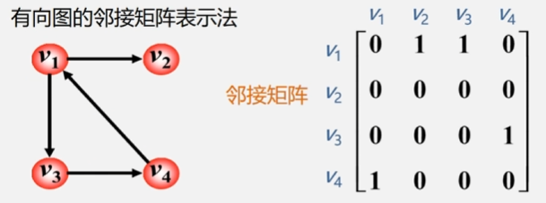
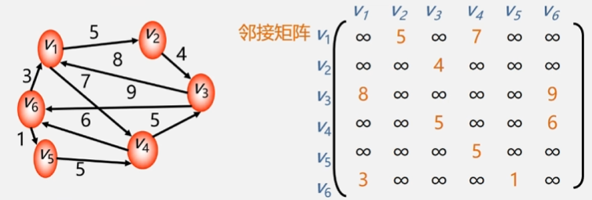
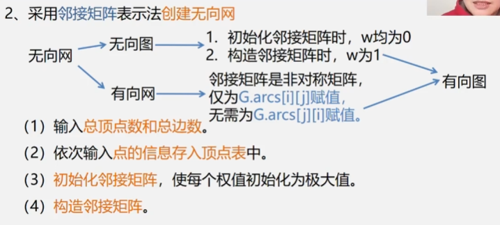
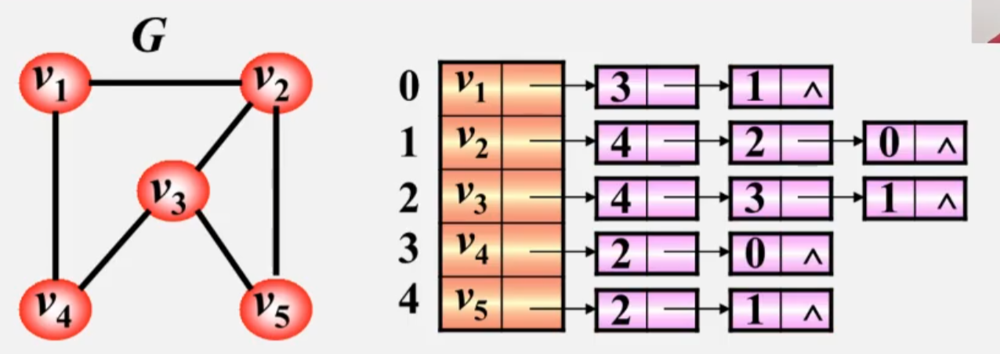
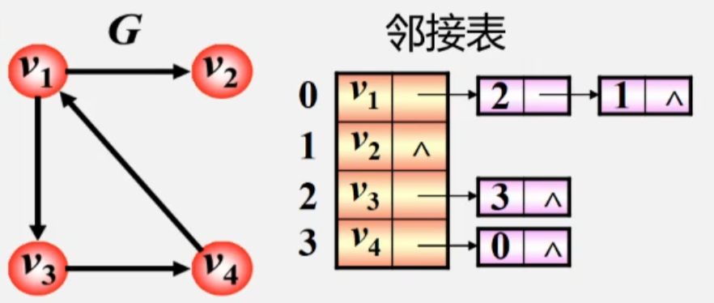
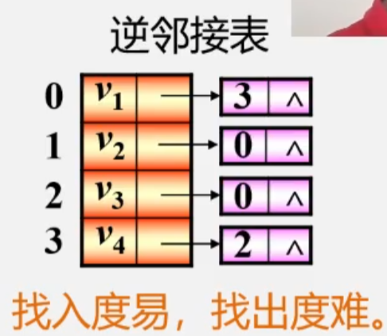
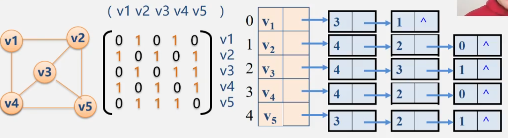
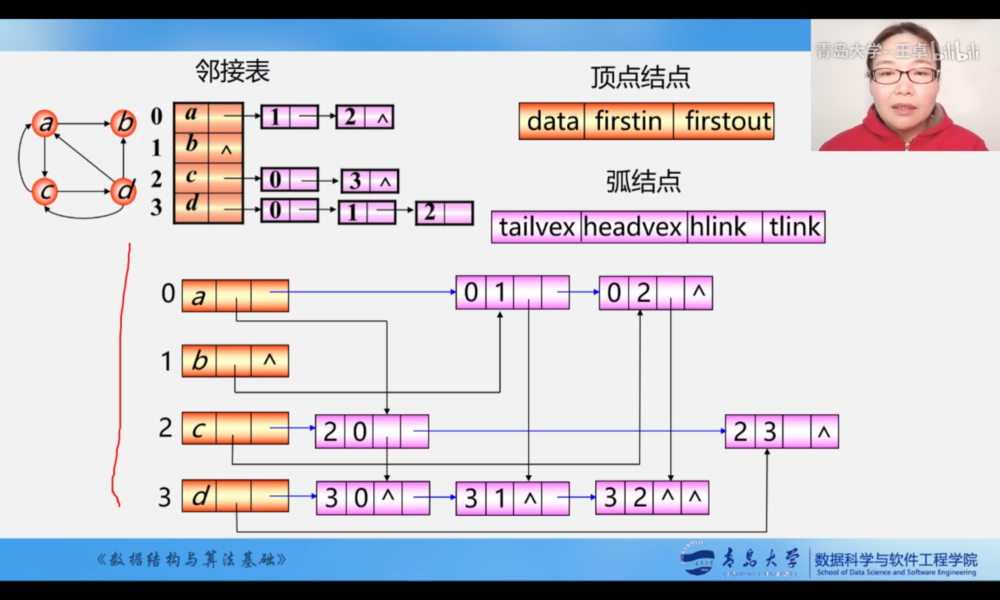
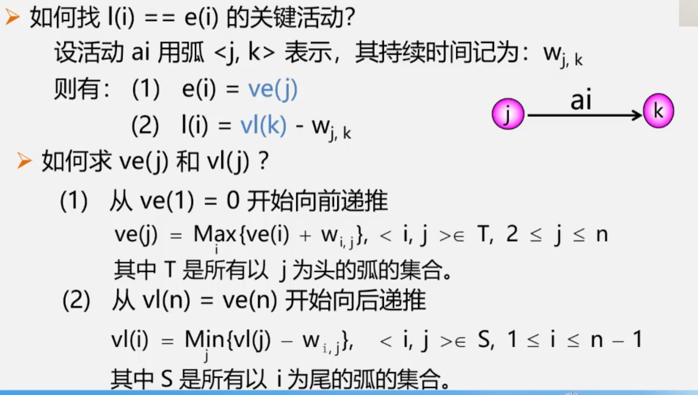

# 图的定义和术语
+ 图：G=(V,E)  
V:顶点（数据元素）的有穷非空集合；  
E：边的集合；  
+ 无向图：每条边都是无方向的
+ 有向图：每条边都是有方向的
+ 完全图：任意两个点都有一条边相连；
+ 稀疏图：有很少边或弧的图（e<nlogn)
+ 稠密图:有较多边或弧的图
+ 网：边/弧带权的图"()"表示边“<>”表示弧
+ 邻接：有边/弧相连的两个顶点之间的关系；存在(v<sub>i</sub>, v<sub>j</sub>)，则称v<sub>i</sub>和 v<sub>j</sub>;互为邻接点;存在<v<sub>i</sub>,  v<sub>j</sub>>，则称v<sub>i</sub>念接到v v<sub>j</sub>,v<sub>j</sub>邻接于v<sub>i</sub>
+ 关联（依附）：边/弧与顶点之间的关系
+ 存在(v<sub>i</sub>, v<sub>j</sub>)/ <v<sub>i</sub>,  v<sub>j</sub>>， 则称该边/弧关联于v<sub>i</sub>和v<sub>j</sub>;
+ 顶点的度: 与该顶点相关联的边的数目，记为TD(v)
  - 在有向图中,顶点的度等于该顶点的入度与出度之和。
  - 顶点 v 的入度是以 v 为终点的有向边的条数记作ID(v)
  - 顶点 v 的出度是以 v 为始点的有向边的条数记作 OD(v)
+ 路径：接续的边构成的顶点序列
  - 路径长度：路径上边或弧的数目/权值之和
  - 回路(环): 第个顶点和最后一个顶点相同的路径
  - 简单路径:除路径起点和终点可以相同外，其余顶点均不相同的路径
  - 简单回路(简单环): 除路径起点和终点相同外，其余顶点均不相同的路径
+ 连通图 (强连通图)：在无 (有) 向图G=(V，{E})中，若对任何两个顶点 v、u都存在从v 到 u 的路径，则称G是连通图 (强连通图）、
+ 权和网：图中边或弧所具有的相关数称为权表明从一个顶点到另一个顶点的距离或耗费
+ 子图：设有两个图G=(V，{E}) 、G1= (V1，{E1}) ，若V1∈V，E1∈E则称 G1是G的子图
+ 连通分量（强连通分量）：无向图G 的极大连通子图称为G的连通分量
  - 极大连通子图意思是: 该子图是 G 连通子图，将G 的任何不在该子图中的顶点加入，子图不再连通
  - 有向图G 的极大强连通子图称为G的强连通分量
  - 极大强连通子图意思是: 该子图是G的强连通子图，将D的任何不在该子图中的顶点加入，子图不再是强连通的。
+ 极小连通子图:该子图是G 的连通子图，在该子图中删除任何一条边子图不再连通
+ 生成树:包含无向图G所有顶点的极小连通子图
+ 生成森林:对非连通图，由各个连通分量的生成树的集合
# 案例引入
# 图的类型定义
# 图的存储结构
+ 数组表示法
  - 图没有顺序存储结构但可以借助二维数组来表示元素间的关系
  - 邻接矩阵
+ 链式存储结构:
  - 邻接表
  - 邻接多重表
  - 十字链表
**重点介绍：邻接矩阵，邻接表**
## 邻接矩阵
建立一个顶点表(记录各个顶点信息)和一个邻接矩阵（表示各个顶点之间关系)。  
设图A=(V,E)有n个顶点，则顶点表Vexs[n]


|i|0|1|2|...|n-1|
| --- | --- | --- | --- | --- | ---  |
|Vexs[i]|v1 |v2|v3|...|vn|

图的邻接矩阵是一个二维数组 A.arcs[n][n]，定义为

$$A.arcs[i][j] =
  \begin{cases}
    1       & \quad \text{if } \langle i,j\rangle∈E \text{ or }(i,j)∈E\\
    0  & \quad \text{else}
  \end{cases}$$

**无向图的邻接矩阵表示方法**：  

+ 分析1:无向图的邻接矩阵是对称的
+ 分析2:顶点i的度=第i行(列)中1 的个数
+ 完全图的邻接矩阵中，对角元素为0，其余1.

无向图的创建：  
+ (1)输入总顶点数和总边数
+ (2)依次输入点的信息存入顶点表中
+ (3)初始化邻接矩阵，使每个权值初始化为0
+ (4)构造邻接矩阵，权值为1
  
```
class Graph {
private:
    int numVertices;
    vector<vector<int>> adjacencyMatrix;
    unordered_map<int, string> vertexTable;  // 顶点表，将顶点的标识映射到实际的顶点名称

public:
    // 构造函数，初始化图的顶点数、邻接矩阵和顶点表
    Graph(int vertices) : numVertices(vertices), adjacencyMatrix(vertices, vector<int>(vertices, 0)) {}

    // 添加顶点，将顶点标识映射到实际的顶点名称
    void addVertex(int id, const string& name) {
        vertexTable[id] = name;
    }

    // 添加边
    void addEdge(int src, int dest) {
        // 无向图，两个方向都要设置为1
        adjacencyMatrix[src][dest] = 1;
        adjacencyMatrix[dest][src] = 1;
    }

    // 打印邻接矩阵
    void printMatrix() {
        // 打印顶点表
        cout << "Vertex Table:" << endl;
        for (const auto& entry : vertexTable) {
            cout << entry.first << ": " << entry.second << endl;
        }

        // 打印邻接矩阵
        cout << "Adjacency Matrix:" << endl;
        for (int i = 0; i < numVertices; ++i) {
            for (int j = 0; j < numVertices; ++j) {
                cout << adjacencyMatrix[i][j] << " ";
            }
            cout << endl;
        }
    }
};
```

**有向图的邻接矩阵表示法**：  

+ 第i行含义:以结点v<sub>i</sub>为尾的弧(即出度边) ;
+ 第i列含义:以结点v<sub>i</sub>为头的弧(即入度边).
+ 分析1:有向图的邻接矩阵可能是不对称的。
+ 分析2: 顶点的出度=第i行元素之和  
            顶点的入度=第i列元素之和

有向图的构建时只为一个方向赋值```adjacencyMatrix[src][dest] = 1;```,其余操作与无向图一致。

**网（有权图）的邻接矩阵表示法**：   
定义为:

$$A.arcs[i][j] =
  \begin{cases}
    W_{ij}       & \quad \text{if } \langle i,j\rangle∈E \text{ or }(i,j)∈E\\
    \infty  & \quad \text{else}
  \end{cases}$$



无向图的创建：  
+ (1)输入总顶点数和总边数
+ (2)依次输入点的信息存入顶点表中
+ (3)初始化邻接矩阵，使每个权值初始化为极大值
+ (4)构造邻接矩阵，```adjacencyMatrix[src][dest] = w;adjacencyMatrix[dest][src] = w;```w为权值
  
有向图的创建：仅赋值```adjacencyMatrix[src][dest] = w;```



**优缺点**：  
优点:
+ 直观、简单、好理解
+ 方便检查任意一对顶点间是否存在边
+ 方便找任一顶点的所有“邻接点”(有边直接相连的顶点)
+ 方便计算任一顶点的“度”(从该点发出的边数为“出度”，指向该点的边数为“入度”)

缺点：
+ 不便于增加和删除顶点
+ 浪费空间-存稀疏图 (点很多而边很少)有大量无效元素
+ 浪费时间一统计稀疏图中一共有多少条边
## 邻接表
**顶点**：按编号顺序将顶点数据存储在一组一维数组中；  
**关联同一项的边**：用线性链表存储；

**无向图**的邻接表：  

特点：  
+ 邻接表不唯一
+ 若无向图中有 n 个顶点、e条边，则其邻接表需 n 个头结点和2e 个表结点。适宜存储稀疏图。
+ 无向图中顶点v<sub>i</sub>的度为第 i个单链表中的结点数.

**有向图**的邻接表：  

特点：  
+ 顶点v<sub>i</sub>的出度为第i个单链表中的结点个数。
+ 顶点v<sub>i</sub>的入度为整个单链表中邻接点域值是i-1的结点个数
+ 找出度容易，找入度难  
  

**逆邻接表**：  

特点：  
+ 顶点v<sub>i</sub>的入度为第i个单链表中的结点个数。
+ 顶点v<sub>i</sub>的出度为整个单链表中邻接点域值是i-1的结点个数
+ 找入度容易，找出度难

**算法思想**：  
+ （1）输入总顶点数和总边数
+ （2）建立顶点表，依次输入点的信息存入顶点表中，使每个表头结点的指针域初始化为NULL
+ 创建邻接表依次输入每条边依附的两个顶点确定两个顶点的序号i和j，建立边结点将此边结点分别插入到v<sub>i</sub>和v<sub>j</sub>对应的两个边链表的头部

**特点**:  
+ 方便找任一顶点的所有“邻接点"
+ 节约稀疏图的空间。需要N个头指针+2E个结点 (每个结点至少2个域)
+ 方便计算任一顶点的“度”?
  - 对无向图:是的
  - 对有向图:只能计算“出度”；需要构造“逆邻接表”(存指自己的边）来方便计算“入度”
+ 不方便检查任意一对顶点间是否存在边
## 邻接矩阵和邻接表的关系

+ 1.联系:邻接表中每个链表对应于邻接矩阵中的一行，链表中结点个数等于一行中非零元素的个数。
+ 2.区别
  - 对于任一确定的无向图邻接矩阵是唯一的 （行列号与顶点编号一致），但邻接表不唯一(链接次序与顶点编号无关)
  - 邻接矩阵的空间复杂度为O(n<sup>2</sup>),而邻接表的空间复杂度为O+e)
+ 用途：邻接矩阵多用于稠密图；邻接表多用于稀疏图；
## 十字链表


# 图的遍历
    **定义**：从已给的连通图中某一顶点出发，沿着一些边访遍图中所有的顶点，且使每个顶点仅被访问一次，就叫做**图的遍历**，它是图的**基本运算。**  
**遍历的实质**：找每个顶点的邻接点的过程  
**特点**：图中可能存在回路，且图的任一顶点都可能与其它顶点相通，在访问完某个顶点之后可能会沿着某些边又回到了曾经访问过的顶点。  
*怎么避免重复访问*：  
设置辅助数组，用来标记每个被访问过的顶点。
## 深度优先搜索（Deep Firdt Search--DFS）
**方法**：
+ 在访问图中某一起始顶点 v后，由 v出发，访问它的任一邻接顶点w<sub>1</sub>;
+ 再从w<sub>1</sub>出发，访问与w<sub>1</sub>接但还未被访问过的顶点w<sub>2</sub>
+ 然后再从w<sub>2</sub>出发，进行类似的访问
+ 如此进行下去，直至到达所有的邻接顶点都被访问过的顶点u为止
+ 接着，退回一步，退到前一次刚访问过的顶点，看是否还有其它没有被访问的邻接顶点
+ 如果有，则访问此顶点，之后再从此顶点出发，进行与前述类似的访问;
+ 如果没有，就再退回一步进行搜索。重复上述过程，直到连通图中所有顶点都被访问过为止

**邻接矩阵表示的无向图深度遍历实现**：
```
#include <iostream>
#include <vector>

using namespace std;

class Graph {
private:
    int V; // 顶点数
    vector<vector<int>> adjMatrix; // 邻接矩阵

public:
    Graph(int vertices) : V(vertices) {
        adjMatrix.resize(V, vector<int>(V, 0));
    }

    // 添加边
    void addEdge(int v, int w) {
        adjMatrix[v][w] = 1;
        adjMatrix[w][v] = 1; // 如果是无向图，还需要将另一方向也设置为1
    }

    // 深度优先搜索
    void DFS(int startVertex, vector<bool>& visited) {
        cout << startVertex << " ";
        visited[startVertex] = true;

        // 遍历当前顶点的邻接顶点
        for (int neighbor = 0; neighbor < V; ++neighbor) {
            // 如果邻接顶点未被访问，并且存在边相连
            if (!visited[neighbor] && adjMatrix[startVertex][neighbor] == 1) {
                DFS(neighbor, visited);
            }
        }
    }

    // 对外提供的接口，用于启动DFS
    void startDFS(int startVertex) {
        vector<bool> visited(V, false);

        cout << "DFS Traversal starting from vertex " << startVertex << ": ";
        DFS(startVertex, visited);

        cout << endl;
    }
};

int main() {
    // 创建一个图并添加边
    Graph g(6);
    g.addEdge(0, 1);
    g.addEdge(0, 2);
    g.addEdge(1, 3);
    g.addEdge(2, 4);
    g.addEdge(2, 5);

    // 从顶点0开始进行DFS
    g.startDFS(0);

    return 0;
}
```
:point_right: 用**邻接矩阵**来表示图，遍历图中每一个顶点都要**从头扫描**该顶点所在行，时间复杂度为O(n<sup>2</sup>) :point_left:  
:point_right: 用**邻接表**来表示图，虽然有 2e个表结点，需扫描 e个结点即可完成遍历，加上访问 n个头结点的时间，时间复杂度为O(n+e). :point_left:

## 广度优先搜索（Breadth Firdt Search--BFS）
方法:从图的某一结点出发，首先依次访问该结点的所有邻接点 Vi1,Vi2...Vin再按这些顶点被访问的先后次序依次访问与它们相邻接的所有未被访问的顶点。重复此过程，直至所有顶点均被访问为止。

```
#include <iostream>
#include <vector>
#include <queue>

using namespace std;

class Graph {
private:
    int V; // 顶点数
    vector<vector<int>> adjList; // 邻接表

public:
    Graph(int vertices) : V(vertices) {
        adjList.resize(V);
    }

    // 添加边
    void addEdge(int v, int w) {
        adjList[v].push_back(w);
    }

    // 广度优先搜索
    void BFS(int startVertex) {
        // 记录已访问的顶点
        vector<bool> visited(V, false);

        // 使用队列来实现BFS
        queue<int> q;

        // 将起始顶点入队并标记为已访问
        q.push(startVertex);
        visited[startVertex] = true;

        cout << "BFS Traversal starting from vertex " << startVertex << ": ";

        while (!q.empty()) {
            // 出队并访问当前顶点
            int currentVertex = q.front();
            q.pop();
            cout << currentVertex << " ";

            // 遍历当前顶点的邻接顶点
            for (int neighbor : adjList[currentVertex]) {
                // 如果邻接顶点未被访问，则入队并标记为已访问
                if (!visited[neighbor]) {
                    q.push(neighbor);
                    visited[neighbor] = true;
                }
            }
        }

        cout << endl;
    }
};

int main() {
    // 创建一个图并添加边
    Graph g(6);
    g.addEdge(0, 1);
    g.addEdge(0, 2);
    g.addEdge(1, 3);
    g.addEdge(2, 4);
    g.addEdge(2, 5);

    // 从顶点0开始进行BFS
    g.BFS(0);

    return 0;
}
```
:point_right:如果使用**邻接矩阵**，则BFS对于每一个被访问到的顶点，都要循环检测矩阵中的整整一行 ( n 个元素)，总的时间代价为O(n<sup>2</sup>) :point_left:  
:point_right: 用**邻接表**来表示图，虽然有 2e 个表结点，但只需扫描 e 个结点即可完成遍历，加上访问 n个头结点的时间，时间复杂度为O(n+e). :point_left:

## DFS与BFS算法效率比较
+ 空间复杂度相同，都是O(n)（借用了堆栈或队列）
+ 时间复杂度只与存储结构（邻接矩阵或邻接表）有关，而与搜索路径无关；

# 图的应用
**生成树**：
1. 一个图可以有许多棵不同的生成树
2. 所有生成树具有以下共同特点
   + 生成树的顶点个数与图的**顶点个数相同**
   + 生成树是图的**极小连通子图**，去掉一条边则非连通
   + 一个有n个顶点的连通图的生成树有 n-1条边
   + **在生成树中再加一条边必然形成回路**
## 无向图生成树
:clown_face: 深度优先生成树  
:clown_face: 广度优先生成树  
设图 G=(V，E)是个连通图，当从图任一顶点出发遍历图G时，将边集 E(G)分成两个集合T(G)和B(G)。其中T(G)是遍历图时所经过的边的集合，B(G)是遍历图时未经过的边的集合。显然，G1(V, T)是图G的极小连通子图。即子图G1是连通图G的**生成树**
## 最小生成树
	:pinched_fingers: 给定一个无向网络，在该网的所有生成树中，使得**各边权值之和最小**的那棵生成树称为该网的**最小生成树**，也叫最小代价生成树
## **构造最小生成树Minimum Spanning Tree**
构造最小生成树的算法很多，其中多数算法都利用了**MST的性质**  
**MST性质**:  
设N=(V，E) 是一个连通网，U 是顶点集V的一个非空子集。若边(u,v)是一条具有最小权值的边，其中u∈U，v∈V-U，则必存在一棵包含边(u,v)的最小生成树。  
**解释**：   
在生成树的构造过程中，图中n个顶点分属两个集合  
+ 已落在生成树上的顶点集:U
+ 尚未落在生成树上的顶点集: V-U  
  
接下来则应在所有连通U中顶点和V-U中顶点的边中选取权值最小的边
### 普利姆（Prim）算法
**算法思想**：  
1. 设N=(V,E)是连通网，TE是N上最小生成树中边的集合
2. 初始令 U={u<sub>0</sub>},(u<sub>0</sub>∈V)，TE={}。
3. 在所有 u∈U，v∈V-U的边(u，v)∈E中，找一条代价最小的边(u<sub>0</sub>，v<sub>0</sub>)。
4. 将(u<sub>0</sub>，v<sub>0</sub>)并入集合 TE，同时v<sub>0</sub>并入 U
5. 重复上述操作直至U=V为止，则T=(V,TE)为的最小生成树
### 库鲁斯卡尔（Kruskal）算法
**算法思想**:  
1. 设连通网 N=(V,E)，令最小生成树初始状态为只有 n个顶点而无边的非连通图T=(V,{})每个顶点自成一个连通分量
2. 在E中选取代价最小的边，若该边依附的顶点落在T中不同的连通分量上(即:不能形成环）则将此边加入到T中;否则，舍去此边，选取下一条代价最小的边
3. 依此类推，直至T中所有顶点都在同七连通分量上为止

### 两种算法的比较

|算法名|普利姆算法|克鲁斯卡尔算法|
|---|---|---|
| 算法思想 | 选择点|选择边|
| 时间复杂度|O(n<sup>2</sup>) |O(eloge)(e为边数)|
|适应范围|稠密图|稀疏图|

## 最短路径
**典型用途:** 交通网络的问题一从甲地到乙地之间是否有公路连通?在有多条通路的情况下，哪一条路最短?  
交通网络用有向网来表示：  
+ **顶点**一一表示地点  
+ **弧**一表示两个地点有路连  
+ **通弧上的权值**一表示两地点之间的距离、交通费或途中所花费的时间等 
   
如何能够使一个地点到另一个地点的运输时间最短或运费最省?这就是一个求两个地点间的**最短路径问题**

**问题抽象**：在有向网中 A 点 (源点) 到达 B 点(终点)的多条路径中，寻找一条**各边权值之和最小**的路径，即**最短路径**

两类常见的最短路径问题：  
:triumph: 单源最短路径——用Dijkstra（迪杰特斯拉）算法
:triumph: 所有顶点间的最短路径——用Floyd（弗洛伊德）算法

### Dijkstra（迪杰特斯拉）算法
**算法思想**：  
1. 初始化: 先找出从源点v,到各终点vk的直达路径 (vo,Vk)即通过一条弧到达的路径
2. 选择: 从这些路径中找出一条长度最短的路径 (Vo,u)
3. 更新:然后对其余各条路径进行适当调整：
   若在图中存在弧 (u,v<sub>k</sub>) ，且 (v<sub>0</sub>,u) + (u,v<sub>k</sub>) < (v<sub>0</sub>,u),v<sub>k</sub>)则以路径 (v<sub>0</sub>,u,v<sub>k</sub>) 代替 (v<sub>0</sub>,v<sub>k</sub>)
4. 在调整后的各条路径中，再找长度最短的路径，依此类推

### Floyd（弗洛伊德）算法
**算法思想**：  
1. 逐个顶点试探
2. 从v<sub>i</sub>到v<sub>j</sub>的所有可能存在的路径中
3. 选出一条长度最短路径
   
## 有向无环图的及应用
    有向无环图：DGA图，无环的有向图
**AOV网**：（拓扑排序）
用一个有向图表示一个工程的各子工程及其相互制约的关系，其中以**顶点表示活动，弧表示活动之间的优先制约关系**，称这种有向图为**顶点表示活动的网**，简称 **AOV网**(Activity On Vertex network)

**AOV网的特点**：
+ 若从i到j有一条有向路径，则i是j的前驱j是i的后继
+ 若<i,j>是网中有向边，则i是j的直接前驱;j是i的直接后继
+ AOV网中不允许有回路，因为如果有回路存在，则表明某项活动以自己为先决条件，显然这是荒谬的。

:raising_hand: 问题：如何判别AOV网中是否存在回路？  
:teacher: **利用拓扑排序**：对有向图构造其顶点的拓扑有序序列，若网中所有顶点都在它的拓扑有序序列中，则该AOV网必定不存在环。

**AOE网**：（关键路径）
用一个有向图表示一个工程的各子工程及其相互制约的关系，以弧表示活动，以顶点表示活动的开始或结束事件，称这种有向图为边表示简称为AOE网(Activity On Edge活动的网，

:raising_hand: (1) 完成整项工程至少需要多少时间?
(2) 哪些活动是影响工程进度的关键?  
:teacher: **关键路径**-路径长度最长的路径；路径长度——路径上各活动持续时间之和


## 拓扑排序（AOVnet）
**定义**：
在AOV 网没有回路的前提下，我们将全部活动排列成一个线性序列，使得若 AOV 网中有弧 <i，j>存在，则在这个序列中，i一定排在j的前面，具有这种性质的线性序列称为**拓扑有序序列**，相应的拓扑有序排序的算法称为**拓扑排序**

算法思想
1. 在有向图中选一个没有前驱的顶点且输出之。
2. 从图中删除该顶点和所有以它为尾的弧。
3. 重复上述两步，直至全部顶点均已输出;或者当图中不存在无前驱的顶点为止

## 关键路径
如何确定关键路径，需要定义4个描述量：
1. ve(vj)- 表示事件 v 的最早发生时间。
2. vl(vj)- 表示事件vi的最迟发生时间
3. e(i)- 表示活动 ai 的最早开始时间
4. l(i)-表示活动 ai 的最迟开始时间
   
l(i)- e(i)-表示完成活动 ai 的时间余量  
**关键活动**——关键路径上的活动，即 l(i) == e(i) (即 l(i) - e(i) ==0 ) 的活动


**算法步骤**：  
1. 求ve(i)、 vl(j)
2. 求 e(i)、l(i)
3. 计算 l(i) - e(i)

讨论：
1. 若网中有几条关键路径，则需加快同时在几条关键路径上的关键活动
2. 如果一个活动处于所有的关键路径上，那么提高这活动的速度，就能缩短整个工程的完成时间。
3. 处于所有的关键路径上的活动完成时间不能缩短太多，否则会使原来的关键路径变成不是头键路径。这时，必须重新寻找关键路径。
# 案例分析与实现